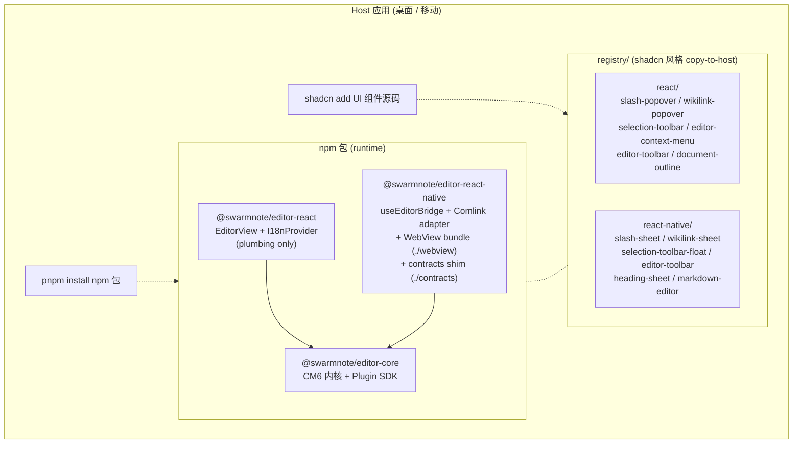
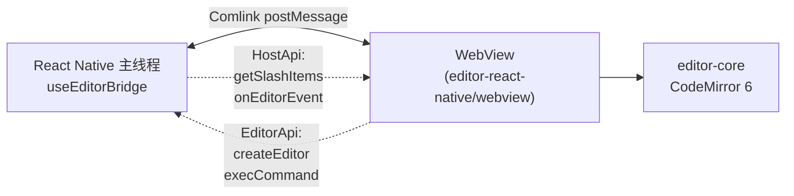

# @swarmnote/editor

基于 CodeMirror 6 的 **Markdown 实时预览编辑器**，host 无关，可被以下场景嵌入：

- Web / Electron / Tauri 桌面端通过 React
- React Native 移动端通过 WebView 桥（Comlink RPC）
- Vue / Svelte / 其他框架（同 WebView 模式，规划中）

生产环境用于 **SwarmNote**（Tauri 桌面）和 **SwarmNote Mobile**（Expo RN）。

## 技术栈

| 层 | 技术 |
|----|------|
| 编辑器内核 | CodeMirror 6 (`@codemirror/*`, `@lezer/markdown`) |
| Markdown 解析 | lezer-markdown + Obsidian 风格 live-preview 装饰 |
| 协作 | Yjs + Awareness (`yjs`, `y-protocols`, `y-codemirror.next`) |
| Plugin SDK | `EditorPlugin` 契约 — 内置 math / mermaid / table / slash / wikilink / selection toolbar 等 11 个 plugin |
| 构建 | tsdown (基于 Rolldown 的 ESM + CJS + d.ts) |
| WebView 桥 | Comlink over `postMessage`（`react-native-webview` ↔ `editor-react-native/webview` bundle） |
| TypeScript | strict mode, ES2020 target |
| 单体仓 | pnpm workspaces |

UI primitives（popover / toolbar / sheet）通过 **shadcn 风格 registry** 分发（Tailwind / NativeWind / Radix / RN-Reusables），不打包进 npm 包。

## 架构（v0.4）



### 包说明（v0.4）

| 包 | 角色 | 层 |
|----|------|----|
| `@swarmnote/editor-core` | CodeMirror 6 内核 + Plugin SDK（math / table / mermaid / slash / wikilink / selection toolbar 等） | npm |
| `@swarmnote/editor-react` | React 适配 — `EditorView` + `I18nProvider`（plumbing only；UI 在 registry） | npm |
| `@swarmnote/editor-react-native` | RN 桥（`useEditorBridge` + Comlink adapter）+ WebView bundle（`./webview` subpath）+ 类型 shim（`./contracts` subpath） | npm |
| `registry/` | shadcn 风格 UI primitives（Web + RN） | 源码分发 |

**为什么这么拆？** `editor-core` 是 framework-agnostic 的运行时引擎 — 走 npm 合理。UI primitives（popover / toolbar）每个 host 都会重度定制，所以以**源码方式分发**（你 copy 后 own，shadcn 哲学）。`editor-react` / `-native` 是最薄的适配，装一次基本不变。

> **v0.4 合并**：原 `@swarmnote/editor-web` 包并入 `editor-react-native`（`./webview` 子目录）。RN 消费者只装一个 npm 包就拿到桥 + WebView bundle。

## 仓库结构

```text
swarmnote-editor/
├── pnpm-workspace.yaml          # workspace 清单
├── package.json                 # workspace root (private)
├── tsconfig.base.json           # 共享 TS 编译选项
├── cliff.toml                   # git-cliff 配置
├── CHANGELOG.md                 # release notes
├── RELEASING.md                 # 发布流程文档
├── scripts/
│   └── release.mjs              # bump + changelog + tag 一条龙
├── packages/
│   ├── editor-core/             # @swarmnote/editor-core
│   ├── editor-react/            # @swarmnote/editor-react
│   └── editor-react-native/     # @swarmnote/editor-react-native
│       ├── src/                 # RN 主线程适配（tsdown 构建）
│       └── webview/             # WebView 端 bundle（vite 构建）
└── registry/                    # shadcn 风格组件 registry
    ├── registry.json
    ├── react/                   # Web (shadcn / Radix / Tailwind)
    └── react-native/            # RN (RN-Reusables / NativeWind / @gorhom/bottom-sheet)
```

## 集成指南

### Web / 桌面（React + Tailwind）

**1. 安装运行时：**

```bash
pnpm add @swarmnote/editor-core @swarmnote/editor-react
```

**2. 从 registry 拉你需要的 UI primitives：**

```bash
# v0.4 之后通过 CLI；当前 spike 阶段从 registry/react/ 手动 copy
npx shadcn add @swarmnote/slash-popover
npx shadcn add @swarmnote/wikilink-popover
npx shadcn add @swarmnote/selection-toolbar
npx shadcn add @swarmnote/document-outline
npx shadcn add @swarmnote/editor-toolbar
npx shadcn add @swarmnote/editor-context-menu
```

文件落到你的 `src/components/editor/` 和 `src/lib/`。可以随意改 — 它们是你的。

**3. 挂载编辑器：**

```tsx
import { createEditor, EditorEventType } from '@swarmnote/editor-core';
import { tablePlugin } from '@swarmnote/editor-core/plugins/table';
import { mathPlugin } from '@swarmnote/editor-core/plugins/math';
import { slashCommandPlugin } from '@swarmnote/editor-core/plugins/interactions/slash';
import { wikilinkPlugin } from '@swarmnote/editor-core/plugins/interactions/wikilink';
import { selectionToolbarPlugin } from '@swarmnote/editor-core/plugins/interactions/selectionToolbar';
import { useEffect, useRef, useState } from 'react';
import { SlashPopover } from '@/components/editor/slash-popover';
import { WikilinkPopover } from '@/components/editor/wikilink-popover';
import { SelectionToolbar } from '@/components/editor/selection-toolbar';

export function MyEditor() {
  const parentRef = useRef<HTMLDivElement>(null);
  const [control, setControl] = useState(null);
  const [slashMatch, setSlashMatch] = useState(null);
  const [wikilinkMatch, setWikilinkMatch] = useState(null);
  const [selToolbarMatch, setSelToolbarMatch] = useState(null);

  useEffect(() => {
    if (!parentRef.current) return;
    const c = createEditor(parentRef.current, {
      initialText: '# Hello\n\nStart writing...',
      plugins: [
        tablePlugin(),
        mathPlugin(),
        slashCommandPlugin(),
        wikilinkPlugin(),
        selectionToolbarPlugin(),
      ],
      host: {
        getSlashItems: async (query) => [/* basic blocks + 自定义 items */],
        getWikilinkItems: async (query) => [/* 匹配 query 的 notes */],
        openLink: (url) => {
          // 路由内部 note 或 fallback 到系统浏览器
        },
      },
      onEvent: (event) => {
        if (event.kind === EditorEventType.SlashTriggerChange) {
          setSlashMatch(event.match.active ? event.match : null);
        } else if (event.kind === EditorEventType.WikilinkTriggerChange) {
          setWikilinkMatch(event.match.active ? event.match : null);
        } else if (event.kind === EditorEventType.SelectionToolbarChange) {
          setSelToolbarMatch(event.match.active ? event.match : null);
        }
      },
    });
    setControl(c);
    return () => c.destroy();
  }, []);

  return (
    <>
      <div ref={parentRef} className="h-full" />
      <SlashPopover match={slashMatch} control={control} />
      <WikilinkPopover match={wikilinkMatch} control={control} />
      <SelectionToolbar match={selToolbarMatch} control={control} />
    </>
  );
}
```

或者用 React 薄包装：

```tsx
import { EditorView } from '@swarmnote/editor-react';

<EditorView
  initialText="# Hello"
  plugins={[tablePlugin(), slashCommandPlugin(), /* ... */]}
  host={{ getSlashItems, getWikilinkItems, openLink }}
  onEvent={handleEvent}
/>
```

### React Native（Expo / bare RN）

编辑器跑在 WebView 内；RN 通过 Comlink 与之对话。registry 中的 `markdown-editor` 组件就是 WebView wrapper。

**1. 安装运行时：**

```bash
pnpm add @swarmnote/editor-core @swarmnote/editor-react-native
pnpm add react-native-webview @gorhom/bottom-sheet comlink lucide-react-native
```

> WebView HTML bundle 已内置在 `@swarmnote/editor-react-native/webview` subpath，
> 不需要额外安装 `@swarmnote/editor-web`（v0.3 之前的旧包，v0.4 合并到 RN 包了）。

**3. 从 registry 拉 UI primitives：**

```bash
# v0.4 通过 react-native-reusables CLI；当前从 registry/react-native/ 手动 copy
# slash-sheet, wikilink-sheet, selection-toolbar-float,
# editor-toolbar, heading-sheet, markdown-editor
```

**4. 在你的页面中接入编辑器：**

```tsx
import { MarkdownEditor } from '@/components/editor/markdown-editor';
import { SlashSheet } from '@/components/editor/slash-sheet';
// host 负责提供 slash/wikilink items、链接路由、editor 事件处理
// 完整 reference 见 registry/react-native/components/markdown-editor.tsx
// 生产示例：SwarmNote-RN/src/components/editor/MarkdownEditor.tsx
// (含 file-tree 驱动的 wikilink 解析)
```

> 关键 Metro / asset 加载细节在 `registry/react-native/components/markdown-editor.tsx`
> 注释里有；SwarmNote-RN 的 `dev-notes/knowledge/editor.md` 有踩坑记录。



### Vue / Svelte / 其他（规划中）

WebView 模式是 framework-agnostic 的 — 同样的 Comlink 契约，只是用 `ref`/`watch` 替代 React `useState`。参考 spike 归档：
`SwarmNote/openspec/changes/archive/2026-05-13-spike-editor-sibling-v04-cross-platform-trio/` 含 Vue 3 适配草图。

## 开发本仓

```bash
git clone https://github.com/swarm-apps/swarmnote-editor.git
cd swarmnote-editor
pnpm install
pnpm -r build
```

需要 Node ≥ 22 + pnpm ≥ 10。

watch 构建（活跃开发时）：

```bash
pnpm --filter @swarmnote/editor-core dev   # 内核
pnpm --filter @swarmnote/editor-react-native dev:webview    # WebView bundle
```

## 与 host 仓联动开发

两个生产 host 通过 `pnpm.overrides` + `link:` 协议接入本仓。clone 为同级目录：

```text
parent/
├── swarmnote-editor/      ← 本仓
├── SwarmNote/             ← Tauri 桌面 host
└── SwarmNote-RN/          ← Expo / RN host
```

在 host 仓 `pnpm install` 会自动解析 link。改 `editor-core` 后下一次 watch build (`dev`) 或全量 build (`build`) 时 host 自动接到新代码；改 `editor-react-native/webview/` 后需要重 build WebView bundle（`pnpm build:vite`）。

**用环境变量覆盖默认 sibling 路径：**

```bash
SWARMNOTE_EDITOR_LOCAL_PATH=/custom/path pnpm tauri dev          # 桌面
SWARMNOTE_EDITOR_LOCAL_PATH=/custom/path npx expo start --clear  # RN
```

### Host 侧接线（host 仓已配置好）

- **桌面 SwarmNote** — `pnpm.overrides` 把 `editor-core` + `editor-react` 指向 sibling。Tailwind 4 `@source` directive 扫描 `editor-react/dist`。
- **SwarmNote-RN** — `pnpm.overrides` 覆盖 `editor-core`、`editor-react-native`（v0.4 起 editor-web 已合并）。Metro `watchFolders` 包含 sibling 仓根（不只是 `packages/*`）才能读 pnpm `.pnpm/` store。`resolver.resolveRequest` 把 `react` / `react-native` / `scheduler` pin 到 host `node_modules`（避免 double-React）。三个 Metro 坑详见 SwarmNote-RN 的 `dev-notes/knowledge/editor.md`。

## Plugin 开发

内置 plugin 放在 `@swarmnote/editor-core/plugins/*`。第三方 plugin 实现 `EditorPlugin` 接口：

```ts
import type { EditorPlugin } from '@swarmnote/editor-core';

export function myCustomPlugin(): EditorPlugin {
  return {
    id: 'my-custom',
    version: '1.0.0',
    setup(ctx) {
      // ctx.registerCommands({ ... })
      // ctx.registerCmExtensions(extensions)
      // ctx.registerSlashItems({ provide: () => [...] })
      // ctx.on(EditorEventType.Change, listener)
    },
  };
}
```

可工作示例见 `packages/editor-core/src/plugins/*`（math / table / slash / wikilink）。Plugin SDK 契约在 `packages/editor-core/src/types.ts`。

## 状态

| 包 | 状态 |
|----|------|
| `editor-core` | v0.4 stable — 暂未发布 npm |
| `editor-react` | v0.4 stable — 暂未发布 npm |
| `editor-react-native` | v0.4 stable(含 WebView bundle + contracts subpath) — 暂未发布 npm |
| `registry/` | Spike 阶段 — 手动 copy；CLI 流程验证中 |

首次发布计划见
`SwarmNote/openspec/changes/sibling-v04-shadcn-distribution/`。

## License

MIT
