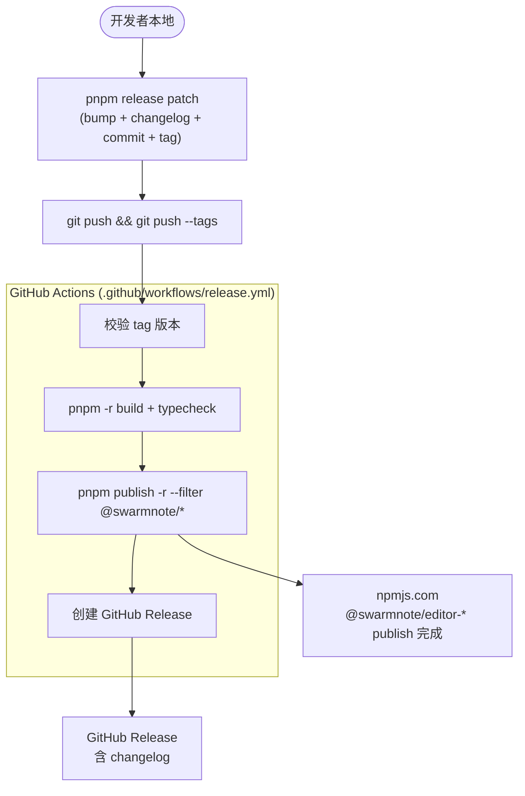
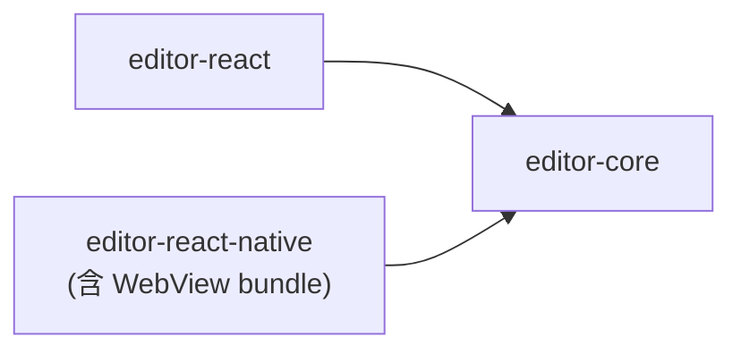

# 发布指南

`@swarmnote/editor` monorepo 的 4 个包统一通过 lockstep 版本号发布到 npm。

## 一次性配置

### 1. 注册 npm scope

在 [npmjs.com](https://www.npmjs.com/) 上：

1. 创建 / 登录账号
2. 创建组织（org）`swarmnote`（或个人 scope `@your-username` — 视具体仓库名而定）
3. 把 `@swarmnote/editor-*` 4 个包名占位（首次 publish 时占名）

> 当前 `package.json` 中的 scope 是 `@swarmnote`，与 GitHub org `swarm-apps` 不一致是预期的——npm scope 由 npm org 名决定，与 GitHub 无关。

### 2. 生成 npm access token

1. npmjs.com → Account Settings → Access Tokens → Generate New Token
2. 选 **Granular Access Token**（推荐）或 **Automation Token**：
   - Scope: `@swarmnote` (or `*`)
   - Permission: Read + Write
   - Expiration: 1 year (or shorter)
3. 复制 token（仅显示一次）

### 3. 配置 GitHub repository secrets

仓库 → Settings → Secrets and variables → Actions → New repository secret：

| Secret 名 | 值 | 用途 |
|----------|----|------|
| `NPM_TOKEN` | 上一步生成的 token | CI 发布 npm 用 |

`GITHUB_TOKEN` 由 Actions 自动提供，**不需要**手动配置。

### 4. 启用 npm provenance（可选但推荐）

`provenance: true` 已配置在每个包的 `publishConfig` 中。需要：

- GitHub Actions OIDC 已启用（默认开启）
- npm `2FA` 配置为 `auth-only`（不是 `auth-and-writes`，否则 CI 写会被拦截）

可在 npm 设置中：Account Settings → Security → Require 2FA → `auth-only`。

## 发布流程

### 本地准备

```bash
# 1. 确保在 main 分支且 working tree 干净
git checkout main
git pull

# 2. 运行 release 脚本（自动 bump + 生成 changelog + commit + tag）
pnpm release patch    # 0.1.0 → 0.1.1
# 或
pnpm release minor    # 0.1.0 → 0.2.0
pnpm release major    # 0.1.0 → 1.0.0
pnpm release 1.0.0-beta.0   # 显式版本号
```

脚本会：

1. ✓ 检查 main 分支 + working tree 干净
2. ✓ Bump 4 个包 + 根 `package.json` 版本号（lockstep）
3. ✓ 用 `git-cliff` 重新生成 `CHANGELOG.md`
4. ✓ 提交 `chore(release): vX.Y.Z`
5. ✓ 创建标签 `vX.Y.Z`

### 推送触发 CI 发布

```bash
git push && git push --tags
```

GitHub Actions 收到 tag push 后：

1. ✓ 校验 tag 版本号匹配 `editor-core/package.json`
2. ✓ `pnpm install --frozen-lockfile`
3. ✓ `pnpm -r typecheck`
4. ✓ `pnpm -r build`
5. ✓ `pnpm publish -r --filter "@swarmnote/*" --no-git-checks --provenance`
6. ✓ 用 git-cliff 提取本次版本的 release notes
7. ✓ 创建 GitHub Release（含 release notes）

整个过程约 2-3 分钟。

### 发布失败回滚

CI 失败时：

- 已 publish 部分包：**不可撤销**（npm 24 小时内可 `npm unpublish`，超过后只能 deprecate）
- 未 publish：本地 reset tag + 修复

```bash
# 本地撤销 release commit + tag
git tag -d vX.Y.Z
git push origin :refs/tags/vX.Y.Z    # 删远程 tag
git reset --hard HEAD~1               # 撤销 release commit
```

## 流程图



## CI workflows 总览

| Workflow | 触发 | 作用 |
|----------|------|------|
| `.github/workflows/ci.yml` | push to `main` / `feat-**` / PR | typecheck + build + test |
| `.github/workflows/release.yml` | push tag `v*` | publish to npm + GitHub release |

## 包发布顺序

`pnpm publish -r` 会按依赖图自动排序。当前顺序：



`editor-core` 先发，`editor-react` / `editor-react-native` 并行跟上。`workspace:*` 协议自动替换为已发版本号。

> v0.4 起 `@swarmnote/editor-web` 合并进 `editor-react-native`（`./webview` 子目录），少一个包要维护 + 少一个 publish 步骤。

## 常用命令

| 命令 | 作用 |
|------|------|
| `pnpm release <type>` | 完整发布流程（bump + tag） |
| `pnpm changelog` | 重新生成完整 CHANGELOG.md |
| `pnpm changelog:unreleased` | 预览未发布部分（不写文件） |
| `pnpm build` | 构建所有包 |
| `pnpm typecheck` | 类型检查所有包 |

## 单包发布（紧急修复）

正常流程是 lockstep 4 包一起发。若只想发单包：

```bash
# 1. 手动改单个包的 package.json version
# 2. git tag 用单包前缀（避免 release.yml 触发）
# 3. 本地直接发：
cd packages/editor-core
pnpm publish --access public --provenance --no-git-checks
```

`release.yml` 的触发器是 `v*` — 用 `editor-core@x.y.z` 这种 tag 不会触发自动发布。

## 故障排查

### `npm publish` 报 `403 Forbidden`

- 检查 `NPM_TOKEN` secret 是否过期 / 权限是否包含 `@swarmnote` scope
- 包的 `publishConfig.access` 是 `public`（已在每个 `package.json` 配好）
- npm scope 已被你的 org 占有

### `provenance` 报错

- npm OIDC 需要 GitHub Actions 默认 token（已自动）
- workflow 的 `permissions.id-token: write` 已配（见 `release.yml`）
- 本地手动 publish 不会有 provenance（CI 才有）

### tag 与版本不匹配

`release.yml` 第一步会校验 `tag = editor-core/package.json` 的 version。如果不匹配，CI 会 fail 并报错。手动 release 时确保版本号正确。

### 包之间 `workspace:*` 协议

pnpm 在 publish 时自动把 `workspace:*` 替换为 published 版本号（如 `^0.1.1`）。无需手动改。
