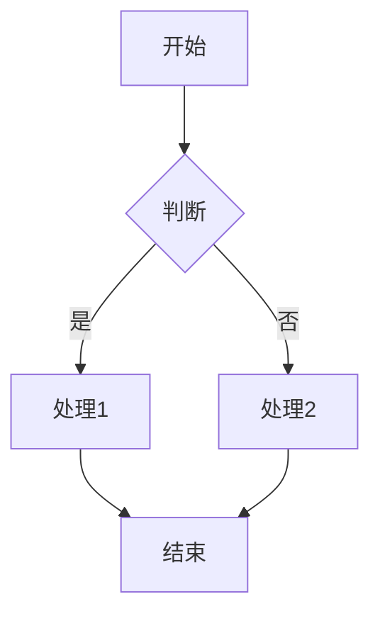

# Mermaid 图表渲染使用指南

## Todo

- [ ] 切换后显示loading的bug
- [ ] 优化代码块的交互和渲染，参考inkdrop的代码块交互效果，还能实现代码提示和补全
- [ ] md frontmater样式优化


## 📦 安装

Mermaid 支持已集成到 `@swarmnote/editor-core` 中，无需额外安装。

## 🚀 快速开始

### 1. 默认启用（推荐）

Mermaid 渲染功能**默认启用**，无需额外配置：

```typescript
import { createEditor } from '@swarmnote/editor-core';

const editor = createEditor(container, {
  initialText: '# My Document\n\n```mermaid\ngraph TD\n    A --> B\n```\n',
});
```

编辑器会自动识别并渲染 ````mermaid` 代码块。

### 2. 交互说明

**预览模式（光标在代码块外）：**
- 显示渲染后的 SVG 图表卡片
- 悬停卡片时显示源码图标和放大图标
- **点击图片区域或放大图标** → 发出 `MermaidZoomRequest` 事件，宿主层打开放大 Modal
- **点击源码图标** → 选中源码区域，CodeMirror 显示原始 ```mermaid 代码块

**编辑模式（光标在代码块内）：**
- CodeMirror 显示原始的 Markdown 源码（包括 ```mermaid 和 ``` 分隔符）
- 可以直接编辑 Mermaid 代码
- 光标移出代码块后，自动切换回预览模式（重新渲染图表）

### 3. 手动控制（可选）

如需禁用 Mermaid 渲染，可以在创建编辑器时配置：

```typescript
const editor = createEditor(container, {
  initialText: markdownContent,
  settings: {
    features: {
      mermaidRendering: false,  // 禁用 Mermaid 渲染
    },
  },
});
```

或者使用扩展的配置选项：

```typescript
import { createBlockMermaidExtension } from '@swarmnote/editor-core';

// 在 extensions 中显式配置
const editor = createEditor(container, {
  initialText: markdownContent,
  extensions: [
    createBlockMermaidExtension({ enabled: false }),  // 禁用
  ],
});
```

### 4. 监听放大查看事件

当用户点击 Mermaid 卡片的图片区域或 🔍 放大按钮时，会发出 `MermaidZoomRequest` 事件：

```typescript
import { EditorEventType } from '@swarmnote/editor-core';

const editor = createEditor({
  parent: container,
  doc: markdownContent,
  extensions: [createBlockMermaidExtension()],
  onEvent: (event) => {
    if (event.kind === EditorEventType.MermaidZoomRequest) {
      console.log('Mermaid 图表 ID:', event.id);
      console.log('Mermaid 源码:', event.source);
      console.log('渲染的 SVG:', event.renderedSvg);
      
      // 在这里显示 Modal/Dialog
      showMermaidModal(event);
    }
  },
});
```

## 💡 Web 平台示例（React）

```tsx
import React, { useState } from 'react';
import { createEditor, createBlockMermaidExtension, EditorEventType } from '@swarmnote/editor-core';

function MermaidEditor() {
  const [zoomData, setZoomData] = useState(null);
  const containerRef = useRef<HTMLDivElement>(null);

  useEffect(() => {
    const editor = createEditor({
      parent: containerRef.current,
      doc: '# Hello\n\n```mermaid\ngraph TD\n    A --> B\n```\n',
      extensions: [createBlockMermaidExtension()],
      onEvent: (event) => {
        if (event.kind === EditorEventType.MermaidZoomRequest) {
          setZoomData({
            source: event.source,
            renderedSvg: event.renderedSvg,
            id: event.id,
          });
        }
      },
    });

    return () => editor.destroy();
  }, []);

  return (
    <>
      <div ref={containerRef} />
      
      {zoomData && (
        <MermaidModal
          source={zoomData.source}
          svg={zoomData.renderedSvg}
          onClose={() => setZoomData(null)}
        />
      )}
    </>
  );
}

// Mermaid Modal 组件
function MermaidModal({ source, svg, onClose }) {
  return (
    <div className="modal-overlay" onClick={onClose}>
      <div className="modal-content" onClick={(e) => e.stopPropagation()}>
        <button onClick={onClose}>关闭</button>
        <div dangerouslySetInnerHTML={{ __html: svg }} />
        <textarea defaultValue={source} />
      </div>
    </div>
  );
}
```

## 📱 React Native 示例

```tsx
import React, { useState } from 'react';
import { Modal, View, Text, TouchableOpacity } from 'react-native';
import { WebView } from 'react-native-webview';
import { createEditor, createBlockMermaidExtension, EditorEventType } from '@swarmnote/editor-core';

function MermaidEditorRN() {
  const [zoomData, setZoomData] = useState(null);

  const handleEditorEvent = (event) => {
    if (event.kind === EditorEventType.MermaidZoomRequest) {
      setZoomData(event);
    }
  };

  // 将 SVG 包装为 HTML 供 WebView 渲染
  const htmlContent = zoomData ? `
    <!DOCTYPE html>
    <html>
    <head>
      <meta name="viewport" content="width=device-width, initial-scale=1.0">
      <style>
        body { margin: 0; padding: 20px; background: #fff; }
        svg { max-width: 100%; height: auto; }
      </style>
    </head>
    <body>
      ${zoomData.renderedSvg}
    </body>
    </html>
  ` : '';

  return (
    <>
      {/* Editor 组件 */}
      <SwarmNoteEditor
        onEvent={handleEditorEvent}
        extensions={[createBlockMermaidExtension()]}
      />

      {/* Modal 查看器 */}
      <Modal
        visible={!!zoomData}
        animationType="slide"
        onRequestClose={() => setZoomData(null)}
      >
        <View style={{ flex: 1 }}>
          <TouchableOpacity onPress={() => setZoomData(null)}>
            <Text>关闭</Text>
          </TouchableOpacity>
          
          <WebView
            originWhitelist={['*']}
            source={{ html: htmlContent }}
            scalesPageToFit={true}
          />
        </View>
      </Modal>
    </>
  );
}
```

## 🎨 主题适配

Mermaid 扩展会自动检测编辑器的 light/dark 主题并应用相应的 Mermaid 主题：

- **Light 主题** → Mermaid `default` 主题
- **Dark 主题** → Mermaid `dark` 主题

主题切换时会自动重新渲染所有图表。

## 🔄 清除缓存

如果需要强制重新渲染所有 Mermaid 图表（例如主题变化后），可以 dispatch 清除缓存的 effect：

```typescript
import { clearMermaidCacheEffect } from '@swarmnote/editor-core';

// 在需要时触发
view.dispatch({ effects: [clearMermaidCacheEffect.of(undefined)] });
```

## 📝 Markdown 语法

在 Markdown 中使用 Mermaid 代码块：

````markdown

````

支持的图表类型：
- ✅ 流程图（flowchart / graph）
- ✅ 时序图（sequenceDiagram）
- ✅ 类图（classDiagram）
- ✅ 状态图（stateDiagram）
- ✅ 甘特图（gantt）
- ✅ 饼图（pie）
- ✅ 用户旅程图（journey）
- ✅ Git 图（gitGraph）
- ✅ ER 图（erDiagram）
- ✅ 象限图（quadrantChart）

## ⚙️ 高级用法

### 自定义 Mermaid 配置

目前 Mermaid 使用默认配置。如需自定义，可以修改 `renderBlockMermaid.ts` 中的 `loadMermaid()` 函数：

```typescript
mermaid.initialize({
  startOnLoad: false,
  securityLevel: 'loose',
  theme: 'default',
  // 添加其他配置...
  fontFamily: 'Arial',
  flowchart: {
    useMaxWidth: true,
    htmlLabels: true,
  },
});
```

### 性能优化

- **懒加载**：Mermaid 库仅在首次渲染时加载
- **渲染缓存**：相同源码的图表不会重复渲染
- **虚拟滚动**：通过 `estimatedHeight` 优化长文档滚动性能

## ❓ 常见问题

### Q: 图表渲染失败怎么办？

A: 渲染失败时会显示错误提示和原始源码。检查控制台错误信息，确认 Mermaid 语法是否正确。

### Q: 如何导出图表为图片？

A: 宿主层接收到 `renderedSvg` 后，可以使用 Canvas API 或第三方库转换为 PNG/SVG 文件。

### Q: 支持协作编辑吗？

A: 支持。Mermaid 扩展基于 CodeMirror StateField，与 Yjs 协作编辑兼容。

### Q: 移动端体验如何？

A: 建议在移动端使用 Modal 全屏查看，避免在小屏幕上直接编辑复杂图表。

## 📚 相关资源

- [Mermaid 官方文档](https://mermaid.js.org/)
- [CodeMirror 6 文档](https://codemirror.net/docs/)
- [SwarmNote Editor 文档](../../README.md)
