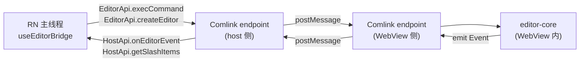

# @swarmnote/editor-react-native

`@swarmnote/editor-core` 的 React Native 适配 — **桥 + WebView bundle 一体打包**。
提供 Comlink endpoint adapter、`useEditorBridge` / `useEditorFormatting` hooks、
`I18nProvider`，以及 WebView 端跑的 editor runtime（含全部内置 plugin）。

本包有三个入口：

- 主入口 `@swarmnote/editor-react-native` — hooks + adapter（RN 主线程用）
- `./contracts` subpath — 事件 / 类型 / 常量（type-only safe，可跨 Comlink）
- `./webview` subpath — WebView HTML bundle（`require('@swarmnote/editor-react-native/webview')`）

UI primitives（slash sheet / wikilink sheet / selection toolbar / editor toolbar /
heading sheet / markdown-editor wrapper）通过 [shadcn 风格 registry](../../registry/)
的 `registry/react-native/` 分发，用 RNR CLI（或手动 copy）落到 host 的 `src/components/`。

## 本包导出

| 导出 | 用途 |
|------|------|
| `useEditorBridge` | Comlink 桥 hook — 接 `EditorApi` proxy + 暴露 `HostApi` |
| `useEditorFormatting` | 选区 formatting 状态 hook（驱动 toolbar active 状态） |
| `createRNEndpoint` | 给 WebView postMessage 用的底层 Comlink endpoint 适配器 |
| `registerTransferHandlers` | 注册 Comlink 的 `Uint8Array` 处理器 |
| `WebViewRef` | 桥所需的最小 ref 形状 `{ injectJavaScript }` |
| `I18nProvider` / `useT` / `TFunction` | 轻量 i18n context |

### Subpath exports

| 路径 | 内容 |
|------|------|
| `@swarmnote/editor-react-native` | 主入口（hooks + adapter） |
| `@swarmnote/editor-react-native/contracts` | 类型 + 常量（`EditorEventType` / `SlashItem` / `EditorApi` 等） |
| `@swarmnote/editor-react-native/webview` | WebView HTML bundle（`require` 加载为 asset） |

## 安装

```bash
pnpm add @swarmnote/editor-react-native @swarmnote/editor-core
pnpm add comlink react-native-webview
```

Peer 依赖（host 自带）：

- `react` ^19
- `react-native` ≥ 0.83
- `comlink` ^4
- `@swarmnote/editor-core`（RN 主线程仅 type-only 使用）

## Metro 注意事项（关键）

Metro 默认不跟随 sibling pnpm symlink，并且 double React 会破坏 hooks。
最小 host `metro.config.js`：

```js
const siblingRoot = path.resolve(__dirname, '../swarmnote-editor');

config.watchFolders = [...(config.watchFolders ?? []), siblingRoot];
config.resolver.unstable_enableSymlinks = true;
config.resolver.extraNodeModules = {
  ...config.resolver.extraNodeModules,
  '@swarmnote/editor-core': path.join(siblingRoot, 'packages/editor-core'),
  '@swarmnote/editor-react-native': path.join(siblingRoot, 'packages/editor-react-native'),
};

// 把 singleton 包 pin 到 host node_modules，避免 sibling devDep 加载第二个 React
const HOST_SINGLETONS = new Set([
  'react', 'react/jsx-runtime', 'react/jsx-dev-runtime',
  'react/compiler-runtime', 'react-native', 'scheduler',
]);
config.resolver.resolveRequest = (context, moduleName, platform) => {
  if (HOST_SINGLETONS.has(moduleName)) {
    return context.resolveRequest(
      { ...context, originModulePath: path.join(__dirname, 'package.json') },
      moduleName, platform,
    );
  }
  return context.resolveRequest(context, moduleName, platform);
};
```

如果 host 在 `app.json` 开启 `experiments.reactCompiler`，
`babel.config.js` 中也要 scope React Compiler：

```js
['babel-preset-expo', {
  'react-compiler': { sources: (f) => f.startsWith(path.join(__dirname, 'src') + path.sep) },
}]
```

## 数据流



## 用法

多数 host 最简便路径是 `shadcn add @swarmnote/markdown-editor`
（从 registry）— 直接拿到完整的 WebView wrapper 可以定制。下面示例
展示如果你想从 hooks 自己拼时，wrapper 内部长啥样：

```tsx
import { useRef, useState, useCallback } from 'react';
import { Asset } from 'expo-asset';
import WebView from 'react-native-webview';
import { View } from 'react-native';
import {
  useEditorBridge,
  useEditorFormatting,
  I18nProvider,
} from '@swarmnote/editor-react-native';
import {
  EditorEventType,
  type EditorEvent,
  type EditorInitOptions,
  type SlashItem,
  type WikilinkItem,
  type SlashTriggerMatch,
} from '@swarmnote/editor-react-native/contracts';

const EDITOR_HTML = require('@swarmnote/editor-react-native/webview');

export function MyEditor({ docUuid, initialState, onCollabUpdate }) {
  const webViewRef = useRef<WebView>(null);
  const [htmlUri, setHtmlUri] = useState<string | null>(null);
  const [slashMatch, setSlashMatch] = useState<SlashTriggerMatch | null>(null);

  useEffect(() => {
    Asset.fromModule(EDITOR_HTML).downloadAsync()
      .then((a) => setHtmlUri(a.localUri ?? null));
  }, []);

  const { formatting, handleEditorEvent } = useEditorFormatting();

  const handleEvent = useCallback((e: EditorEvent) => {
    const kind = (e as { kind: string }).kind;
    if (kind === EditorEventType.SlashTriggerChange) {
      setSlashMatch((e as { match: SlashTriggerMatch }).match);
    }
    handleEditorEvent(e);
  }, [handleEditorEvent]);

  // getSlashItems / getWikilinkItems 通过 Comlink 跨桥
  const getSlashItems = useCallback(async (query: string): Promise<SlashItem[]> => {
    return [/* heading-1, heading-2, list, quote, divider 等 — JSON 可序列化 */];
  }, []);

  const getWikilinkItems = useCallback(async (query: string): Promise<WikilinkItem[]> => {
    return [/* 你的笔记 store 中匹配 query 的 notes */];
  }, []);

  const { editorApi, setWebViewRef, onWebViewMessage } = useEditorBridge({
    onEditorEvent: handleEvent,
    onCollaborationUpdate: onCollabUpdate,
    getSlashItems,
    getWikilinkItems,
  });

  return (
    <I18nProvider t={(_, defaultText) => defaultText}>
      <View style={{ flex: 1 }}>
        <WebView
          ref={(ref) => {
            setWebViewRef(ref ? { injectJavaScript: (js) => ref.injectJavaScript(js) } : null);
          }}
          source={{ uri: htmlUri! }}
          onMessage={onWebViewMessage}
        />
      </View>
    </I18nProvider>
  );
}
```

`onRuntimeReady` 后调 init：

```ts
await editorApi.createEditor({
  initialText: '',
  settings: DEFAULT_EDITOR_SETTINGS,
  enabledPluginIds: [
    'math', 'table', 'mermaid', 'admonition', 'codeBlock',
    'blockImage', 'rawHtml', 'smartPaste',
    'slash', 'wikilink', 'selectionToolbar',
  ],
  // ... collaboration / workspacePath 等
});
```

桥用 Comlink 的 `Uint8Array` transfer handler，让二进制 Y.Doc update
能跨 RN ↔ WebView 边界。message envelope 格式见
`comlink-webview-adapter`。

## HostApi 回调

`useEditorBridge` options 接受这两个回调来给 trigger popover 喂数据；
都是可选（未填默认返回 `[]` — popover 显示 "no matching"）：

| Option | 用途 |
|--------|------|
| `getSlashItems(query)` | `/` 触发器的 items。返回 JSON 可序列化 items（用 `commandId` + `commandArgs`，不能用 `run` 闭包） |
| `getWikilinkItems(query)` | `[[` 触发器的 items。同样 JSON 可序列化。`commit: 'replaceWithLink'` 是安全的 |

链接点击（wikilink + markdown link）— host 在 `onEditorEvent` 中
收到 `EditorEventType.LinkOpen`，在那里解析内部 note vs 外部 URL。

## 构建

```bash
pnpm build       # tsdown → dist/index.{mjs,cjs,d.mts,d.cts}
pnpm dev         # tsdown --watch
pnpm typecheck   # tsc --noEmit
```

## License

MIT
